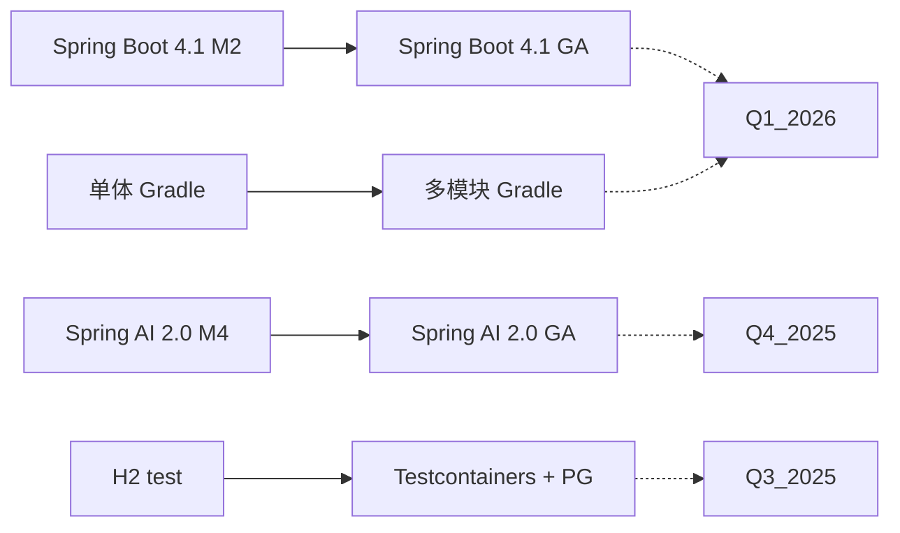

# AgentHub 技术实现方案
> 日期：2025-06-10 · 状态：待审核 · 版本：v1.0

---

## 1. 架构总览

```
┌─────────────────────────────────────────────────┐
│                  Frontend (Vue 3)                │
│         Element Plus · TypeScript · Vite         │
└──────────────────────┬──────────────────────────┘
                       │ REST + SSE
┌──────────────────────▼──────────────────────────┐
│              api (Controller / DTO)              │
│  OpenAPI (springdoc) · ApiExceptionHandler       │
└──────────────────────┬──────────────────────────┘
                       │
┌──────────────────────▼──────────────────────────┐
│         application (UseCase / Port)             │
│  UseCase 单元测试 · port/in 接口定义             │
└───────┬──────────────────────────────┬───────────┘
        │                              │
┌───────▼──────────┐          ┌───────▼──────────┐
│    domain         │          │ infrastructure   │
│  POJO · 无框架依赖 │◄─────────│ 实现 Port 接口   │
│  领域事件 · 异常   │          │  DB/Redis/MinIO  │
└──────────────────┘          │  双 Agent 引擎    │
                              │  ETL/RAG/Camel    │
                              └──────────────────┘
```

### 1.1 当前架构健康度

| 维度 | 评分 | 问题 |
|------|------|------|
| 分层清晰度 | ★★★★★ | ArchUnit 严格保障 |
| 测试覆盖 | ★★☆☆☆ | Controller 层达标，UseCase/前端严重不足 |
| 文档完备性 | ★★☆☆☆ | 无 API 文档，开发文档分散 |
| 构建效率 | ★★★☆☆ | 单模块，编译时间随代码量线性增长 |
| 扩展性 | ★★★★☆ | 端口适配器模式好，但 `port/in` 未启用 |

---

## 2. 阶段一：生产就绪与质量加固（Q3 2025）

### 2.1 OpenAPI/Swagger 文档系统（P1.1）

**方案**：引入 `springdoc-openapi-starter-webmvc-ui`

**步骤**：
1. 添加依赖（已有 Spring Boot 4.1，需确认兼容版本）
2. 配置 `OpenAPI` Bean，设定 title/version/servers
3. 在 Controller 上添加 `@Operation` 和 `@Schema` 注解
4. 配置 `X-Tenant-Id` 全局 Header 参数

```java
// 配置示例
@Bean
public OpenAPI openAPI() {
    return new OpenAPI()
        .info(new Info().title("AgentHub API").version("1.0.0"))
        .addSecurityItem(new SecurityRequirement().addList("bearer"))
        .components(new Components()
            .addSecuritySchemes("bearer",
                new SecurityScheme().type(SecurityScheme.Type.HTTP).scheme("bearer"))
            .addParameters("X-Tenant-Id",
                new Parameter().in(ParameterIn.HEADER).name("X-Tenant-Id").required(true)));
}
```

**文件清单**：
- `build.gradle` — 添加 `springdoc-openapi-starter-webmvc-ui` 依赖
- `infrastructure/config/OpenApiConfig.java` — OpenAPI 配置（新增）
- 39 个 Controller — 添加 `@Operation` / `@Schema` 注解

**验收标准**：
- `GET /v3/api-docs` 返回完整 OpenAPI 规范
- Swagger UI (`/swagger-ui/index.html`) 可交互测试
- 每个端点的 `@Operation(summary = "中文描述")` 完整

---

### 2.2 UseCase 层单元测试覆盖（P1.2）

**方案**：为 Top-10 核心 UseCase 编写 JUnit 5 + Mockito 单元测试

**优先级排序**（按业务重要性）：

| 排序 | UseCase | 已有集成测试 | 需补充测试数 | 核心场景 |
|------|---------|------------|------------|---------|
| 1 | `AgentUseCase` | ✅ 有 | 8 | CRUD + 状态变更 + 验证 |
| 2 | `AgentChatUseCase` | ✅ 有 | 6 | 消息发送/接收/流式 |
| 3 | `DagWorkflowExecutionUseCase` | ✅ 有 | 6 | 拓扑排序/异常回滚 |
| 4 | `KnowledgeBaseUseCase` | ✅ 有 | 5 | 文档管理/检索 |
| 5 | `AuthApplicationUseCase` | ✅ 有 | 4 | JWT 签发/校验/刷新 |
| 6 | `WorkspaceUseCase` | ✅ 有 | 4 | CRUD + 租户隔离 |
| 7 | `ExecutionPlanUseCase` | ❌ 无 | 4 | 计划生成/步骤执行 |
| 8 | `IngestionPipelineUseCase` | ❌ 无 | 4 | 管道执行/异常处理 |
| 9 | `MemoryUseCase` | ✅ 有 | 3 | 记忆存储/检索 |
| 10 | `SkillMarketUseCase` | ✅ 有 | 3 | 市场安装/同步 |

**测试模式**：

```java
// 示例：AgentUseCase 单元测试
class AgentUseCaseTest {
    @Mock AgentRepository agentRepository;
    @Mock AgentTeamRepository teamRepository;
    @InjectMocks AgentUseCase useCase;

    @Test
    void shouldCreateAgentWithValidSpec() {
        var spec = Agent.CreationSpec.builder()
            .name("test-agent").workspaceId(1L).build();
        when(agentRepository.save(any())).thenReturn(anAgent());
        var result = useCase.createAgent(spec, 1L);
        assertThat(result.getName()).isEqualTo("test-agent");
        verify(agentRepository).save(any());
    }

    @Test
    void shouldThrowWhenNameAlreadyExists() {
        when(agentRepository.existsByName("dup", 1L)).thenReturn(true);
        assertThrows(ConflictException.class,
            () -> useCase.createAgent(specWithName("dup"), 1L));
    }
}
```

**目录结构**：
```
src/test/java/com/agenthub/application/usecase/
├── AgentUseCaseTest.java
├── AgentChatUseCaseTest.java
├── DagWorkflowExecutionUseCaseTest.java
├── KnowledgeBaseUseCaseTest.java
├── AuthApplicationUseCaseTest.java
├── WorkspaceUseCaseTest.java
├── ExecutionPlanUseCaseTest.java
├── IngestionPipelineUseCaseTest.java
├── MemoryUseCaseTest.java
└── SkillMarketUseCaseTest.java
```

---

### 2.3 领域模型一致性重构（P1.3）

**问题清单**（已知违规）：

| 文件 | 问题 | 修复方案 |
|------|------|----------|
| `ModelConfig.java` | 使用 `@Builder` | 改为 `CreationSpec` 工厂模式 |
| `DagWorkflow.java` | 手动 getter/setter + `@Data` 混用 | 统一为 `@Data` |
| `Memory.java` | 无 `@Data`，手动方法 | 添加 `@Data` + `@NoArgsConstructor` |
| `Agent.java` | 风格正确 ✅ | 作为参考标准 |
| `GuardrailStrategy.java` | 风格正确 ✅ | 作为参考标准 |

**`CreationSpec` 统一模式**：

```java
// 标准模式（参考 Agent.java）
@Data
@NoArgsConstructor
@AllArgsConstructor
public class SomeDomainModel {
    private Long id;
    private String name;
    // ... fields

    @Data
    @NoArgsConstructor
    @AllArgsConstructor
    public static class CreationSpec {
        private String name;
        // ... creation fields only (no id, no timestamps)
        public static CreationSpec of(String name, ...) {
            var spec = new CreationSpec();
            spec.setName(name);
            // ...
            return spec;
        }
    }

    public static SomeDomainModel create(CreationSpec spec) {
        var model = new SomeDomainModel();
        BeanUtil.copyProperties(spec, model);
        model.setId(null); // generated by infra
        return model;
    }

    public static SomeDomainModel rebuild(Long id, CreationSpec spec) {
        var model = create(spec);
        model.setId(id);
        return model;
    }
}
```

---

### 2.4 port/in 端口定义补全（P1.4）

**当前问题**：`application/port/in/` 目录存在但为空，Controller 依赖具体 UseCase 实现而非接口。

**方案**：为 Top-10 UseCase 抽取入站端口接口。

```java
// 新增：application/port/in/AgentInputPort.java
public interface AgentInputPort {
    AgentOutput createAgent(AgentCommand command, Long workspaceId);
    AgentOutput getAgent(Long id, Long workspaceId);
    PageResult<AgentOutput> listAgents(AgentQuery query, Long workspaceId);
    void deleteAgent(Long id, Long workspaceId);
    void toggleAgent(Long id, boolean enabled, Long workspaceId);
}

// UseCase 实现接口
@Component
@RequiredArgsConstructor
public class AgentUseCase implements AgentInputPort { ... }

// Controller 改为依赖接口
@RestController
public class AgentController {
    private final AgentInputPort agentInputPort; // 原: AgentUseCase
}
```

**文件清单**：

| 端口接口文件 | UseCase |
|-------------|---------|
| `application/port/in/AgentInputPort.java` | AgentUseCase |
| `application/port/in/AgentChatInputPort.java` | AgentChatUseCase |
| `application/port/in/WorkflowInputPort.java` | DagWorkflowExecutionUseCase |
| `application/port/in/KnowledgeBaseInputPort.java` | KnowledgeBaseUseCase |
| `application/port/in/AuthInputPort.java` | AuthApplicationUseCase |
| `application/port/in/WorkspaceInputPort.java` | WorkspaceUseCase |
| `application/port/in/MemoryInputPort.java` | MemoryUseCase |
| `application/port/in/SkillInputPort.java` | SkillUseCase |
| `application/port/in/SkillMarketInputPort.java` | SkillMarketUseCase |
| `application/port/in/TenantInputPort.java` | 租户 UseCase |

---

### 2.5 前端组件测试（P1.5）

**方案**：Vitest + @vue/test-utils + Playwright

**优先组件**（按用户交互频率）：

```
src/main/web/tests/
├── components/
│   ├── AgentForm.spec.ts        # Agent 创建/编辑表单
│   ├── AgentList.spec.ts        # Agent 列表 + 搜索
│   ├── ChatWindow.spec.ts       # 聊天窗口 + 消息渲染
│   ├── WorkflowEditor.spec.ts   # DAG 编辑器
│   └── KnowledgeBaseForm.spec.ts
├── views/
│   ├── LoginView.spec.ts
│   └── DashboardView.spec.ts
├── composables/
│   ├── useAuth.spec.ts          # 认证组合式函数
│   └── useWebSocket.spec.ts     # WebSocket 组合
└── e2e/
    ├── agent-lifecycle.spec.ts  # Playwright E2E
    └── login-flow.spec.ts
```

**测试策略**：
- **组件测试（60%）**: 渲染 + 用户交互 + 事件触发
- **组合式函数测试（20%）**: 状态管理 + API 调用 Mock
- **E2E 测试（20%）**: 关键用户流程（登录→创建 Agent→对话）

---

### 2.6 契约测试（P1.6）

**方案**：Pact (JVM + JS) 前后端契约测试

```
backend (Provider)          frontend (Consumer)
     │                           │
     │  Pact 验证测试             │  Pact 生成合约
     │ ←─────────────────────────│
     │                           │
     │  发布合约到 Pact Broker    │
     │ ─────────────────────────→│
     │                           │
     │  CI 中验证 Provider 兼容   │
     │                           │
```

---

## 3. 阶段二：Agent 智能升级（Q4 2025）

### 3.1 长期记忆持久化（P2.1）

**架构**：

```
Agent Runtime
    │
    ├─→ MemoryInterceptor (AOP 拦截 Agent 执行)
    │       │
    │       ├─→ 决策前：检索相关记忆 → 注入 System Prompt
    │       └─→ 决策后：提取关键信息 → 存入记忆
    │
    ├─→ MemoryStore (port 接口)
    │       │
    │       ├─→ ShortTermMemory (当前 Session，Redis)
    │       ├─→ LongTermMemory (跨 Session，PGVector)
    │       └─→ EpisodicMemory (完整执行记录，ES)
    │
    └─→ MemorySummaryService
            │ 定时对记忆做摘要、压缩、去重
            └─→ 避免向量存储无限膨胀
```

**领域模型扩展**：

```java
// domain/model/agent/AgentMemory.java
@Data
@NoArgsConstructor
@AllArgsConstructor
public class AgentMemory {
    private Long id;
    private Long agentId;
    private Long sessionId;
    private MemoryType type;       // FACT / EPISODE / PREFERENCE
    private String content;
    private float[] embedding;
    private double importance;     // 重要性评分 0-1
    private Instant createdAt;
    private Instant lastAccessedAt;
}
```

**API 扩展**：
- `GET /workspaces/{wsId}/agents/{id}/memories?query=xxx&type=FACT` — 检索记忆
- `POST /workspaces/{wsId}/agents/{id}/memories` — 手动注入记忆
- `DELETE /workspaces/{wsId}/agents/{id}/memories/{memId}` — 删除记忆

**文件清单**：

| 层 | 文件 | 操作 |
|----|------|------|
| domain | `AgentMemory.java` | 新建 |
| domain | `MemoryType.java` | 新建（或扩展已有枚举） |
| application/port/out | `AgentMemoryRepository.java` | 新建 |
| application/usecase | `AgentMemoryUseCase.java` | 新建 |
| application/port/in | `AgentMemoryInputPort.java` | 新建 |
| api/controller | `AgentMemoryController.java` | 新建 |
| api/dto | `AgentMemoryRequest/Response.java` | 新建 |
| infra/db/entity | `AgentMemoryEntity.java` | 新建 |
| infra/db/mapper | `AgentMemoryMapper.java` | 新建 |
| infra/db/repository | `MybatisAgentMemoryRepository.java` | 新建 |
| infra/vector | 复用现有 VectorStore | 配置 PGVector 集合 |
| infra/agents | `MemoryInterceptor.java` | 新建 |
| sql/ | `V2025Q4__create_agent_memory.sql` | 新建 |

---

### 3.2 Agent 自我进化（P2.2）

**架构**：

```
AgentExecution
    │
    ├─→ Complete (任务完成)
    │       │
    │       ├─→ SelfReflectionService
    │       │   ├─→ 执行摘要：干了什么、怎么干的
    │       │   ├─→ 成功分析：哪些决策正确
    │       │   ├─→ 失败分析：哪些决策错误
    │       │   └─→ 模式提取：总结可复用的经验模式
    │       │
    │       └─→ ExperienceStore
    │           ├─→ 存入 `AgentExperience`（结构化）
    │           └─→ 更新 `AgentProfile`（行为画像）
    │
    └─→ Start (新任务启动)
            │
            └─→ ExperienceRetriever
                ├─→ 检索相似历史经验
                └─→ 注入 System Prompt 作为"先验知识"
```

**领域模型**：

```java
// domain/model/agent/AgentExperience.java
@Data
@NoArgsConstructor
@AllArgsConstructor
public class AgentExperience {
    private Long id;
    private Long agentId;
    private String taskType;           // 任务类型标签
    private String contextSummary;     // 上下文摘要
    private String actionSequence;     // 执行决策链
    private String outcome;            // 结果：SUCCESS / FAILURE
    private String patternExtracted;   // 提取的模式
    private int reuseCount;            // 被复用次数
    private double successRate;        // 历史成功率
}
```

**关键设计决策**：
- 进化过程需要**人工审核门控**：提取的模式默认 `PENDING_REVIEW`
- 进化策略可以**回滚**：版本化管理
- 初始阶段只做**模式提取 + 推荐**，不做自动行为修改

---

### 3.3 Graph RAG（P2.4）

**架构**：

```
Document Ingestion
    │
    ├─→ Entity Extraction (LLM 提取实体 + 关系)
    │       │
    │       ├─→ Neo4j 图数据库存储
    │       └─→ 实体向量嵌入 → Vector Store
    │
    ├─→ Query Processing
    │       │
    │       ├─→ Query Analysis (LLM 分析问题类型)
    │       │   ├─→ 简单事实 → 直接向量检索
    │       │   └─→ 多跳推理 → Graph Traversal + Vector
    │       │
    │       ├─→ Graph Traversal (Cypher 查询)
    │       └─→ Fusion Rank (合并 + 重排序)
    │
    └─→ Response Generation
            └─→ LLM 基于图谱上下文生成答案
```

**技术选型**：
- **图数据库**: Neo4j（当前无依赖，需要新增）
- **实体抽取**: LLM + 正则后备
- **存储接口**: `application/port/out/GraphRepository.java`
- **Graph RAG 适配器**: `infrastructure/rag/graph/`

---

## 4. 阶段三：企业级能力深化（Q1 2026）

### 4.1 SSO/OIDC 集成（P3.1）

```java
// 配置：支持 OAuth2 Client + Resource Server 并存
@Configuration
@EnableWebSecurity
public class SecurityConfig {
    // 现有 JWT 过滤链 → /api/v1/auth/**
    // 新增 OAuth2 过滤链 → /api/v1/sso/**
    // 使用 Spring Security OAuth2 Client 的 Login 流程
}
```

**支持流程**：
1. `GET /api/v1/sso/login?provider=azure-ad` → 跳转 IdP
2. IdP 回调 → 创建/匹配本地用户 → 签发 JWT
3. 后续请求携带 JWT，与现有认证体系一致

**测试策略**：
- 使用 `spring-security-test` 的 `@WithMockUser` + OAuth2 测试支持
- WireMock 模拟 IdP 端点

---

### 4.2 RBAC/ABAC 细粒度权限（P3.2）

**模型扩展**：

```java
// domain/model/auth/Role.java
@Data
@NoArgsConstructor
@AllArgsConstructor
public class Role {
    private Long id;
    private Long tenantId;
    private String name;            // ADMIN / OPERATOR / VIEWER / CUSTOM
    private RoleType type;          // BUILTIN / CUSTOM
}

// domain/model/auth/Permission.java
@Data
@NoArgsConstructor
@AllArgsConstructor
public class Permission {
    private Long id;
    private String resource;        // "agent", "workflow", "knowledge-base"
    private String action;          // "create", "read", "update", "delete", "execute"
    private String effect;          // "ALLOW" / "DENY"
}
```

**权限检查拦截**：
- `@PreAuthorize("@authz.check(#workspaceId, 'agent', 'create')")`
- 或自定义 `AuthorizationPort` 接口，UseCase 中调用

---

## 5. 阶段四：生态开放与平台化（Q2 2026）

### 5.1 插件 SDK（P4.1）

**SPI 接口定义**：

```java
// Plugin 核心接口
public interface AgentHubPlugin {
    String pluginId();
    String version();
    PluginType type();              // AGENT / TOOL / KNOWLEDGE
    void init(PluginContext ctx);
    void destroy();
}

// 示例：ToolPlugin
public interface ToolPlugin extends AgentHubPlugin {
    List<ToolDefinition> getTools();
    ToolResult execute(ToolInvocation invocation);
}
```

**类加载隔离**：
- 每个插件独立 ClassLoader（`URLClassLoader`）
- 父 ClassLoader = 平台核心类（非插件 API 包）
- 禁止插件访问平台内部类

---

### 5.2 Webhook 出站通知（P4.2）

```java
// 领域事件统一出站
public interface WebhookPublisher {
    void publish(DomainEvent event);
}

// 配置式路由
webhooks:
  - name: "dingtalk-alert"
    events: [AlertTriggeredEvent, AgentFailureEvent]
    url: https://oapi.dingtalk.com/robot/send?access_token=xxx
    template: "【AgentHub 告警】{{event.severity}}: {{event.message}}"
  - name: "slack-notify"
    events: [AgentDeployedEvent, TaskCompletedEvent]
    url: https://hooks.slack.com/services/xxx
```

---

## 6. 数据库迁移规范

所有数据库变更通过 `sql/` 目录下的版本化脚本管理：

```
sql/
├── V2025Q3.1__add_openapi_config.sql
├── V2025Q3.2__unify_domain_models.sql
├── V2025Q4.1__create_agent_memory.sql
├── V2025Q4.2__create_agent_experience.sql
├── V2025Q4.3__create_graph_entities.sql
├── V2026Q1.1__create_roles_and_permissions.sql
├── V2026Q1.2__create_usage_metering.sql
├── V2026Q2.1__create_plugin_registry.sql
└── V2026Q2.2__create_webhook_configs.sql
```

---

## 7. 测试策略总表

| 层级 | 技术栈 | 目标覆盖率 | 阶段 |
|------|--------|-----------|------|
| UseCase 单元测试 | JUnit 5 + Mockito | 80%+ | Q3 |
| Controller 集成测试 | MockMvc + @SpringBootTest | 90%+ | 已有 |
| ArchUnit 架构测试 | ArchUnit | 22+ 规则 | Q3 |
| 前端组件测试 | Vitest + vue-test-utils | 60%+ | Q3 |
| E2E 测试 | Playwright | 关键流程 100% | Q3 |
| 契约测试 | Pact | 核心 API | Q3+ |
| 性能测试 | JMeter / Gatling | P95 < 500ms | Q4 |

---

## 8. 关键依赖升级路径



---

## 9. 风险与应对

| 技术风险 | 概率 | 影响 | 应对 |
|---------|------|------|------|
| Spring Boot 4.1 M2 API 变动 | 中 | 高 | 升级到 GA 前锁定里程碑依赖版本 |
| Neo4j 增加运维复杂度 | 中 | 中 | Graph RAG 初期可用 PG 的 age 扩展替代 |
| 插件 ClassLoader 内存泄漏 | 低 | 高 | 插件卸载强制 GC + ClassLoader 引用跟踪 |
| 前端迁移到 Nuxt 3 工作量 | 低 | 中 | 当前 Vue + Vite 架构合理，无需迁移 |

---

## 10. 实施节奏建议

### Sprint 0（当前 — 2 周）
```
1. 评审本方案 → 确定优先级
2. 搭建 springdoc OpenAPI 基础框架
3. 选定首个 UseCase（AgentUseCase）编写单元测试样本
4. 统一领域模型风格（先从 ModelConfig.java 开始）
```

### 后续每个 Sprint（2 周）
```
Day 1-2: 方案评审 + 技术设计
Day 3-8: 编码 + 自测
Day 9:   Code Review + 重构
Day 10:  集成测试 + 文档更新 + Demo
```

---

## 11. 总结

AgentHub 当前在架构质量上已达到业界领先水平。**接下来的技术工作应聚焦三个方向**：

1. **补短板** — 测试、文档、一致性等基础工程实践
2. **强智能** — 记忆持久化、自我进化、Graph RAG 等差异化能力
3. **进企业** — SSO、RBAC、计量计费等商业化必备能力

每项技术工作应遵循项目的 TDD 10 步流程，确保架构质量持续保持。
